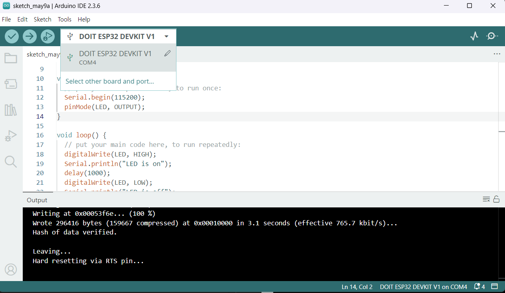

# IoT25-HW01

## Board and Port Setting

- **Board**: ESP32 Dev Module
- **Port**: COM4

## Description

Set up the ESP32 development environment and run the Blink example.  
Used the onboard LED to blink at 1-second intervals.

## Result

### IDE Screenshot

### Execution Video

